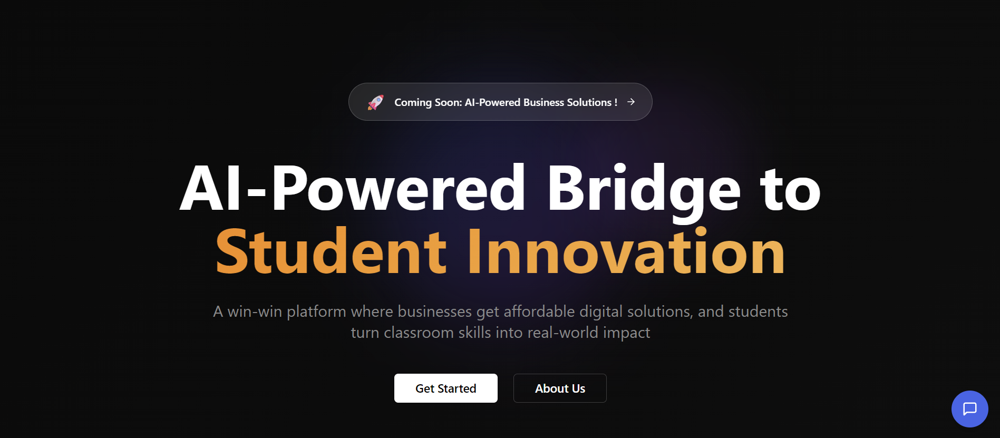

# AI Business Buddy

<div align="center">
  
</div>

<br/>

<div align="center">
  <p>A modern, responsive web application designed to streamline business workflows with AI-powered tools. Built with React, Tailwind CSS, and Firebase.</p>
</div>

---

### ▶️ Live Demo

Access the live application here: **[https://ai-business-buddy.vercel.app/](https://ai-business-buddy.vercel.app/)**

### 📸 Screenshot

<div align="center">
  
</div>

---

## ✨ Features

- **Modern & Responsive Design:** A mobile-first approach ensures a seamless experience on all devices, from desktops to smartphones.
- **User Authentication:** Secure user sign-up, login, and sign-out functionality powered by Firebase Authentication.
- **Interactive UI:** Smooth animations and transitions using Framer Motion provide a dynamic and engaging user experience.
- **Intuitive Dashboard:** A central hub for users to manage their activities and access key features.
- **Project Management:** Tools to create, organize, and track projects effectively.
- **Comprehensive FAQ:** A dedicated section to answer common user questions and provide support.
- **Contact Form:** An easy way for users to send inquiries and feedback.

---

## 🛠️ Tech Stack

- **Frontend:**
  - [**React**](https://reactjs.org/)
  - [**Vite**](https://vitejs.dev/)
  - [**Tailwind CSS**](https://tailwindcss.com/)
  - [**Framer Motion**](https://www.framer.com/motion/) (for animations)
- **Backend & Authentication:**
  - [**Firebase**](https://firebase.google.com/)

---

## 🚀 Getting Started

Follow these steps to get a local copy of the project up and running.

### Prerequisites

- Node.js (v18 or higher recommended)
- npm or yarn
- A Firebase project

### Installation

1.  **Clone the repository:**

    ```sh
    git clone https://github.com/your-username/your-repo-name.git
    ```

2.  **Navigate to the project directory:**

    ```sh
    cd your-repo-name
    ```

3.  **Install dependencies:**

    ```sh
    npm install
    ```

4.  **Set up environment variables:**

    Create a `.env.local` file in the root of your project and add your Firebase project configuration. You can find these keys in your Firebase project settings.

    ```env
    VITE_API_KEY="your-api-key"
    VITE_AUTH_DOMAIN="your-auth-domain"
    VITE_PROJECT_ID="your-project-id"
    VITE_STORAGE_BUCKET="your-storage-bucket"
    VITE_MESSAGING_SENDER_ID="your-messaging-sender-id"
    VITE_APP_ID="your-app-id"
    ```

5.  **Start the development server:**
    ```sh
    npm run dev
    ```
    Open [http://localhost:5173](http://localhost:5173) (or the port specified in your console) to view it in your browser.

---

## 🤝 Contributing

Contributions make the open-source community an amazing place to learn, inspire, and create. Any contributions you make are **greatly appreciated**.

If you have a suggestion that would make this better, please fork the repo and create a pull request. You can also simply open an issue with the tag "enhancement".

1.  **Fork the Project**
2.  **Create your Feature Branch** (`git checkout -b feature/AmazingFeature`)
3.  **Commit your Changes** (`git commit -m 'Add some AmazingFeature'`)
4.  **Push to the Branch** (`git push origin feature/AmazingFeature`)
5.  **Open a Pull Request**

---

## 📄 License

Distributed under the MIT License. See `LICENSE.txt` for more information.
